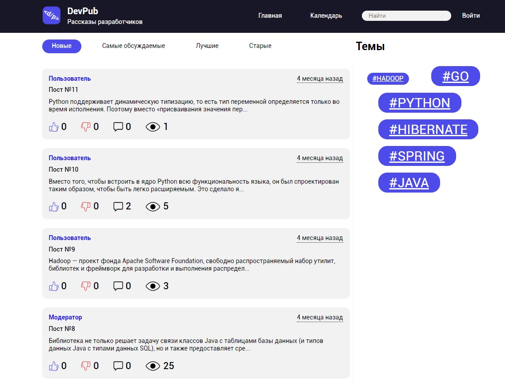

# Blog Engine Backend

## Main technologies:

* Java 11
* Apache Maven
* Spring Framework (Using Spring Boot project)
* MySQL8
* Git

## Additional features:

* Hibernate
* Cage (CAptcha GEnerator)
* Jsoup library
* Lombok project
* FasterXML Jackson